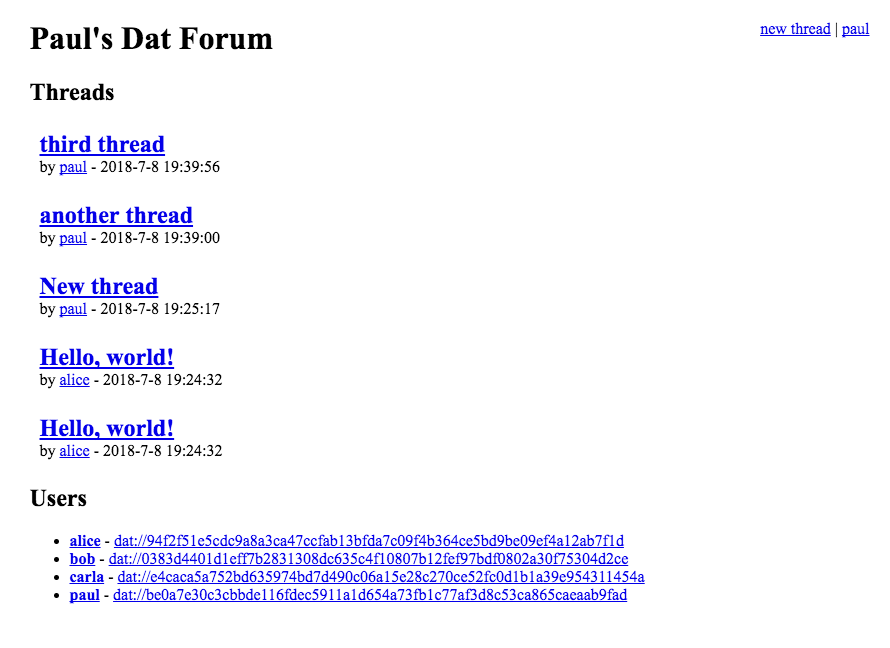

# { http + dat } Web forum

A Web forum built on Dat and HTTP and run in node.js. This application demonstrates a "dat + http hybrid architecture." Involves two roles:

 - **Users**. Must use a browser that supports [Dat](https://datproject.org/). Each user has a "dat archive." They write their posts to `/posts/${site-hostname}/*.json`, and the data is synced to the server.
 - **Server**. An HTTP server. Reads post-files from user dats and stores them in a SQLite DB. Visitors can browse the site to see the content. To participate, they create a Dat archive and submit it to the server.

## Why is this cool?

This forum is federated. Users are identified with global URLs that can easily be reused at other forum instances. User data is signed and saved on the user's computer, so they have full control over it.

---

This is part of an ongoing project series to demonstrate 3 different architectures:

 - [http + dat](https://github.com/pfrazee/node-http-dat-forum). Users visit an http server to see the app & get latest data.
 - dat (nodejs) (**todo**). Users visit a dat archive to see the app & get latest data.
 - dat (SPA) (**todo**). Users visit a dat archive to see the app & get latest data. Run 100% in the browser.

---

## Screenshot

This screenshot is of an instance with 4 users. The 5 visible threads were read from the posts folders of those 4 users' dats.

